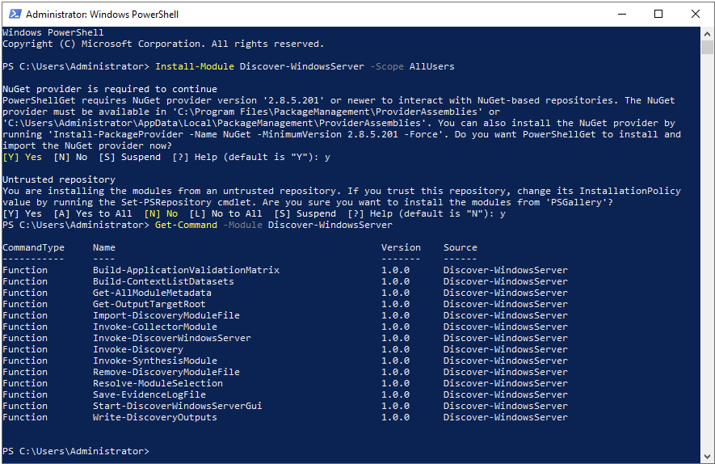
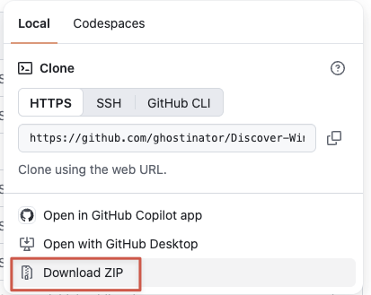
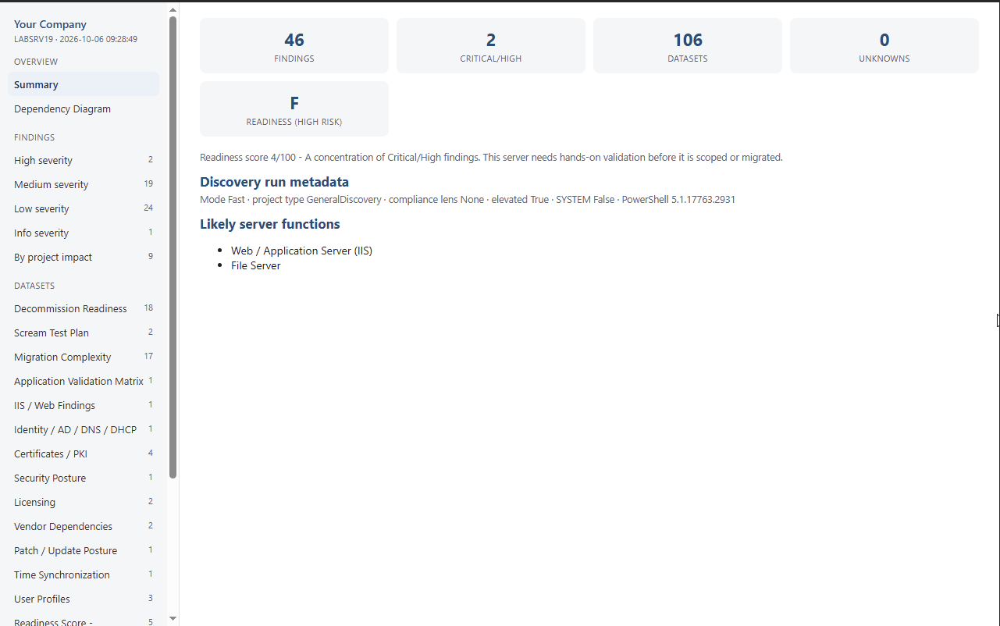
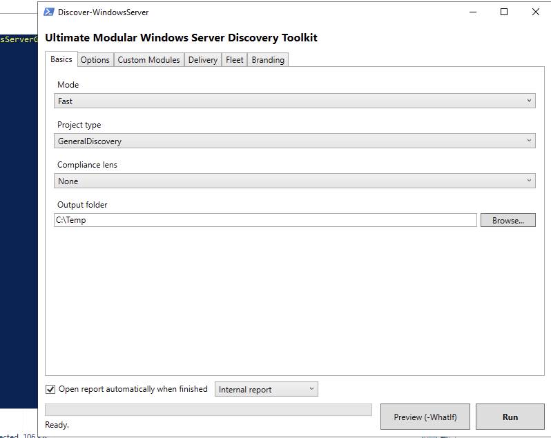
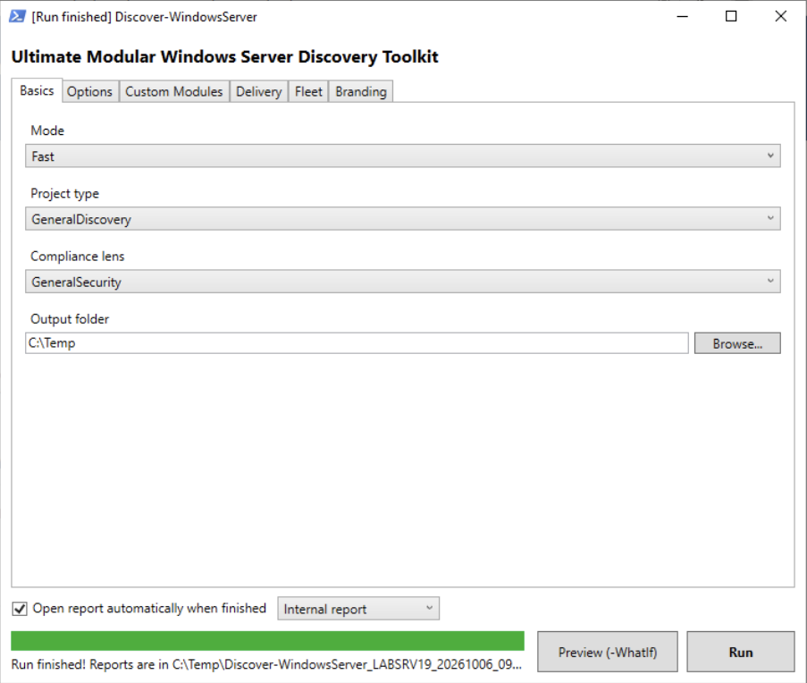
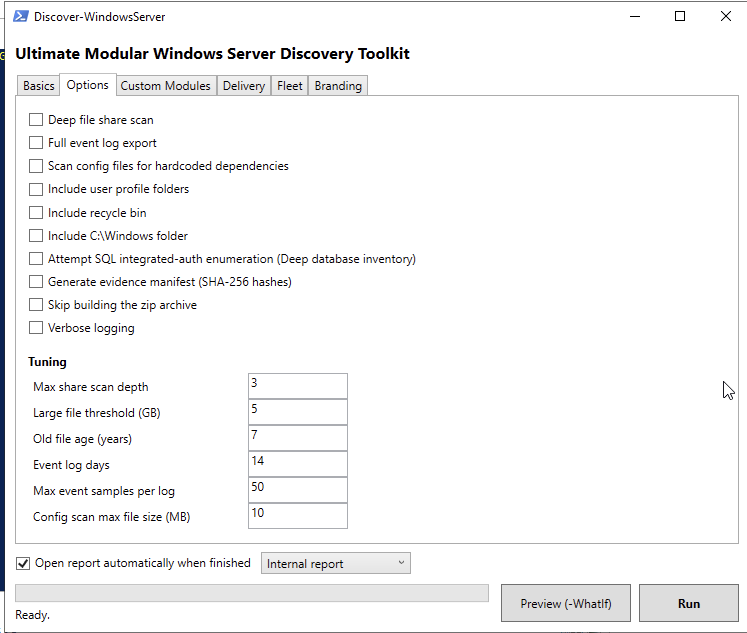
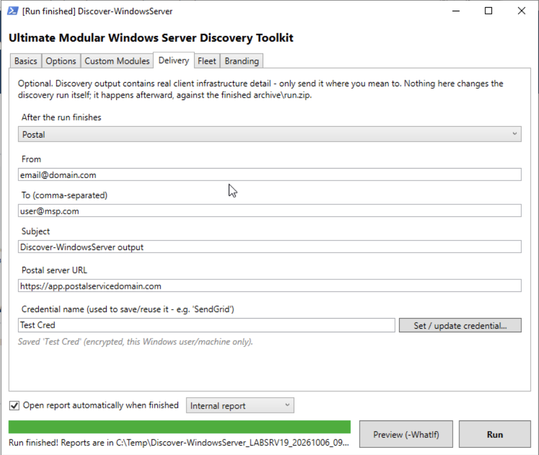
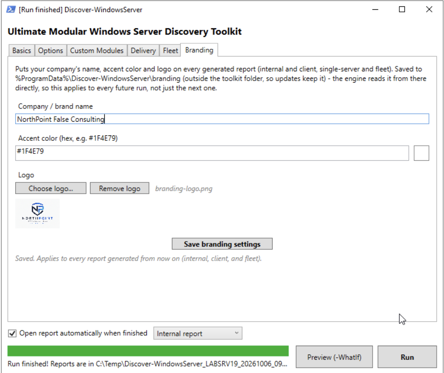
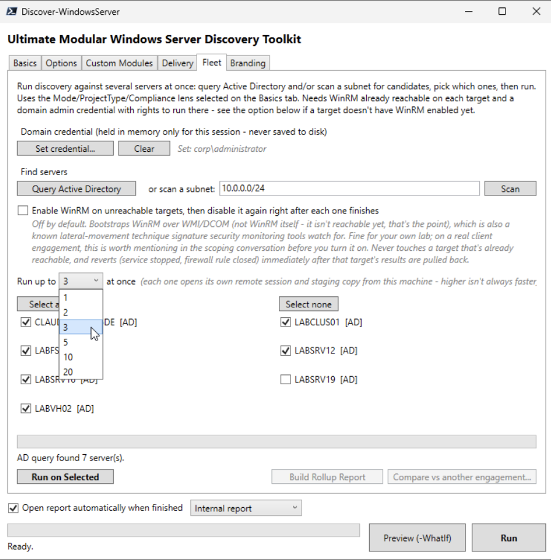

# Ultimate Modular Windows Server Discovery Toolkit

A **read-only**, modular PowerShell toolkit for MSP project scoping of Windows Servers:
server refresh, Hyper-V refresh, application migration, Azure migration, decommission
readiness, CMMC/security review, and infrastructure documentation.

It is not just an inventory script. It is built to answer the questions a Project
Architect needs answered before quoting: what does this server actually do, what depends
on it, what will block a migration, and what should we ask the client before we price the
work.

**At a glance**

- **One server or a whole fleet:** run it on a server, or point the GUI's **Fleet** tab at
  Active Directory or a subnet and scan dozens of servers from one console, with one combined
  report at the end. See [Fleet discovery](#fleet-discovery).
- **29 collectors**, from AD, DNS, DHCP, SQL, IIS, Hyper-V and clustering to file shares,
  certificates, backup agents and licensing, plus a **risk engine with 106 rules** and an
  **A–F readiness score** per server.
- **Deliverables, not just data:** an internal engineering report, an interactive dashboard,
  a client-safe report, draft scope language, client interview questions, a scream-test plan,
  a dependency diagram and more. See [What you get](#what-you-get).
- **Command line or GUI**, installed from the PowerShell Gallery or downloaded from GitHub.
- **Read-only, and never collects secrets.**

## Safety contract

The toolkit is **strictly read-only** against the host. It never restarts services,
never modifies the registry, firewall, scheduled tasks, users/groups, IIS, SQL,
certificates, AD, DNS, DHCP, clustering or Hyper-V; never enables PSRemoting; never
installs modules; never changes execution policy or Group Policy. It writes only inside
its own timestamped output folder.

The one deliberate exception is opt-in and off by default: Fleet's **Enable WinRM on
unreachable targets** checkbox turns WinRM on for a target that doesn't have it, then turns
it off again as soon as that target's scan finishes. See [Fleet discovery](#fleet-discovery).

It also **never collects secrets** — no passwords, hashes, private keys, BitLocker
recovery keys, or RADIUS shared secrets. Values that could carry a credential (service
paths, scheduled-task actions, process command lines) are passed through a redaction
layer covered by a 38-assertion test corpus. See
[docs/MODULE-DEVELOPMENT.md](docs/MODULE-DEVELOPMENT.md) for the full contract.

## Requirements

- Windows Server 2012 R2+ (runs on Windows 10/11 for testing).
- Windows PowerShell 5.1, or PowerShell 7 — no internet, no Excel. Server 2012 R2 ships
  PowerShell 4.0, so it needs PowerShell 7 first: `tools\Install-LegacyPrerequisites.ps1`
  installs it (asks first, never restarts).
- Run **locally** on the server being discovered, or from one admin machine against many
  servers with [Fleet discovery](#fleet-discovery) (needs WinRM and a domain admin credential).
  Elevated is recommended for completeness but not required.
- No external modules required. Optional Windows role modules (ActiveDirectory,
  DnsServer, WebAdministration, Hyper-V, FailoverClusters, …) are used *if already
  present*, never installed.

## Install

Pick one. Both give you the same toolkit, command line and GUI.

### Option A: PowerShell Gallery (recommended)

```powershell
Install-Module Discover-WindowsServer -Scope AllUsers
```

Update later with `Update-Module Discover-WindowsServer`. Saved GUI branding lives outside the
module folder (`%ProgramData%\Discover-WindowsServer\branding`), so updates keep it. On Server
2012 R2, install PowerShell 7 first (see Requirements) and run the commands below from `pwsh`.

The first install on a machine can ask two one-time questions, both standard PowerShellGet
prompts rather than anything this module adds: install the **NuGet provider** (answer `Y`), and
trust the **PSGallery** repository (answer `Y`, or `A` for all).



*First install from the Gallery, including the one-time NuGet and repository prompts, then
`Get-Command -Module Discover-WindowsServer` listing the module's commands, among them
`Invoke-DiscoverWindowsServer` (scan) and `Start-DiscoverWindowsServerGui` (GUI).*

### Option B: Download from GitHub

1. On this repository's page, click **Code → Download ZIP** (the latest `main`), or download
   **Source code (zip)** from the latest [release](https://github.com/ghostinator/Discover-WindowsServer/releases).
   Or clone: `git clone https://github.com/ghostinator/Discover-WindowsServer.git`
2. Extract it somewhere permanent, e.g. `C:\Tools\Discover-WindowsServer`.
3. Unblock the files. Windows marks downloaded files as "from the internet", and under the
   default `RemoteSigned` execution policy those scripts won't run until unblocked:

   ```powershell
   Get-ChildItem C:\Tools\Discover-WindowsServer -Recurse | Unblock-File
   ```



*Downloading from the repository page: **Code → Download ZIP**.*

## Quick start: command line

Run from an **elevated** PowerShell for the most complete results (it also works unelevated,
with gaps recorded as limitations).

| | Installed from the Gallery | Downloaded copy (run from its folder) |
|---|---|---|
| Fast scan (default) | `Invoke-DiscoverWindowsServer` | `.\Discover-WindowsServer.ps1` |
| Deep scan, decommission | `Invoke-DiscoverWindowsServer -Mode Deep -ProjectType Decommission` | `.\Discover-WindowsServer.ps1 -Mode Deep -ProjectType Decommission` |
| CMMC lens | `Invoke-DiscoverWindowsServer -ComplianceLens CMMC` | `.\Discover-WindowsServer.ps1 -ComplianceLens CMMC` |

`Invoke-DiscoverWindowsServer` takes exactly the same parameters as `Discover-WindowsServer.ps1`
(see [docs/README.md](docs/README.md) for all of them).

Output lands in `<OutputRoot>\Discover-WindowsServer_<COMPUTERNAME>_<timestamp>\`
(default `OutputRoot` is `C:\Temp`). Start with `reports\internal-engineering-report.html`
(reads top to bottom, print-friendly) or `reports\internal-dashboard-report.html` (same
findings and datasets, sidebar-navigated with scrollable/filterable tables - better for
onscreen reference on a long run). See [docs/OUTPUT-GUIDE.md](docs/OUTPUT-GUIDE.md) for what
each generated file is for.



*`internal-dashboard-report.html` from a Fast scan of a lab server (LABSRV19). The tiles across
the top summarize the run: 46 findings, 2 of them Critical/High, 106 datasets, and an **F**
readiness grade (an unhardened lab box scores badly, which is the point). Below them are the
likely server functions. The sidebar jumps to findings by severity, to the dependency diagram,
or to any dataset (decommission readiness, scream-test plan, migration complexity and more).
This report uses the default "Your Company" brand; set your own on the GUI's Branding tab.*

<!-- SCREENSHOT TODO (suggested): docs/images/report-findings.png - the same dashboard on
"High severity", one finding expanded to show its severity, confidence, evidence and
recommendation. Lab server or demo data only. -->
<!-- SCREENSHOT TODO (suggested): docs/images/report-client.png - client-discovery-report.html
with your Branding applied (logo, name, accent color): the plain-English client deliverable. -->

## Quick start: GUI

Prefer a window? The optional WPF launcher lets you pick options, watch live progress, and
optionally email or upload the result when it's done. It builds and runs the exact same
command underneath, so results are identical to the command line.

| Installed from the Gallery | Downloaded copy |
|---|---|
| `Start-DiscoverWindowsServerGui` | `.\Discover-WindowsServer-GUI.ps1` from its folder (or right-click it → **Run with PowerShell**) |

Needs a desktop (Desktop Experience or the workstation you RDP from), not Server Core. Start
it from an elevated PowerShell. It relaunches itself in the threading mode WPF needs, so no
`-Sta` switch is required. **Preview (-WhatIf)** shows what a run would do without running it;
**Run** starts the scan.

What each tab does:

| Tab | What you set there |
|---|---|
| **Basics** | Mode (**Fast**, **Deep**, or **Custom**), project type, compliance lens, and output folder. |
| **Options** | Extra collection: a deep file-share scan, full event-log export, a scan of application config files for hard-coded dependencies (SQL servers and connection strings, UNC paths, IP addresses, SMTP/LDAP/HTTP endpoints, license servers; secrets are flagged by location, never copied), user-profile folders, the recycle bin, `C:\Windows`, SQL integrated-auth enumeration, a SHA-256 evidence manifest, skipping the zip, and verbose logging. **Tuning** sets share-scan depth, the large-file and old-file thresholds, event-log days and samples, and the config-scan file-size cap. |
| **Custom Modules** | Pick exactly which collectors run (with Mode = Custom). Choosing Fast or Deep first ticks that mode's modules so you can compare and fine-tune. |
| **Delivery** | After the run, email the zip by SMTP, SMTP2GO, SendGrid or Postal, or upload it to an HTTPS URL (for example a pre-signed S3 or Azure Blob URL). Upload and Postal URLs must be HTTPS. Credentials can be saved encrypted for your Windows account (DPAPI), so you aren't prompted every time. |
| **Fleet** | Scan many servers at once. See [Fleet discovery](#fleet-discovery). |
| **Branding** | Your company name, accent color and logo on every report (internal, client and fleet). Saved outside the toolkit folder, so updates keep it. |

While a scan runs, the window shows live progress: the current module and percent complete.



*The **Basics** tab: Mode, Project type, Compliance lens and Output folder. The bottom bar is on
every tab: **Open report automatically when finished** (internal or client report), the progress
bar and status line, and the **Preview (-WhatIf)** and **Run** buttons.*



*A finished run: the title bar reads **[Run finished]**, the progress bar is full, and the status
line shows where the reports are. With **Open report automatically** ticked, the report opens on
its own.*

<!-- SCREENSHOT TODO (suggested): docs/images/gui-running.png - the same window mid-scan:
progress bar partway, status line naming the current module, Run button disabled. -->

<details>
<summary><strong>More GUI screenshots</strong>: Options, Delivery and Branding tabs</summary>



*The **Options** tab: extra collection switches (all off by default) and **Tuning**, with share-scan
depth 3, large-file threshold 5 GB, old-file age 7 years, 14 event-log days, 50 samples per log,
and a 10 MB config-scan cap. These are the Fast-mode defaults; Deep raises the event-log values.*



*The **Delivery** tab set to **Postal** (example values). After the run, the zip is sent
automatically. The credential is saved encrypted for this Windows user on this machine only
(DPAPI), under the name you give it, so later runs reuse it.*



*The **Branding** tab with a sample brand ("NorthPoint False Consulting", a fictional MSP): name,
accent color and logo, applied to every report (internal, client and fleet) from then on. Saved
to `%ProgramData%\Discover-WindowsServer\branding`, so updates keep it.*

</details>

The **Custom Modules** tab is only editable with Mode = Custom on the Basics tab. See
[tools/Send-DiscoveryOutput.ps1](tools/Send-DiscoveryOutput.ps1) if you only want the
email/upload piece from the command line.

## Fleet discovery

Scoping a whole environment? Instead of logging on to every server, scan them all from one
console and get **one combined report**. Everything runs from the GUI's **Fleet** tab:

1. **Set a credential.** A domain admin credential, held **in memory for that GUI session
   only**: never written to disk, never on a command line.
2. **Find servers.** **Query Active Directory** lists every computer object running a Server OS,
   and/or **Scan** a subnet (e.g. `10.0.0.0/24`), which probes the WinRM port directly rather
   than relying on ping. Both lists are merged and de-duplicated. Each candidate shows whether
   it's reachable, and a server that can't run the engine (PowerShell below 5.1 with no
   PowerShell 7) is flagged **before** you click Run, not after.
3. **Pick and run.** Tick the servers, choose how many run at once (**1, 2, 3, 5, 10 or 20**),
   and click **Run on Selected**. Each target gets a staged copy of the toolkit and runs it
   locally as a SYSTEM scheduled task, so results match a hands-on run. The window shows each
   server's live phase and current module, and every result comes back to one local folder.
4. **Build Rollup Report.** This merges the completed runs into:
   - `fleet-rollup.html`: a combined risk register across all servers, print-friendly.
   - `fleet-dashboard-report.html`: the same, as an interactive dashboard with filterable tables.
   - `fleet-client-summary.html` / `.md`: the client-safe fleet summary, under the same safety
     rules as the single-server client report.
   - A per-server summary with each server's readiness grade, and the fleet average.
5. **Compare vs another engagement** (optional): diff this fleet against an earlier scan of the
   same environment. See [Drift: what changed since last time](#drift-what-changed-since-last-time).

**Servers without WinRM.** Fleet needs WinRM already reachable on each target. The opt-in
**Enable WinRM on unreachable targets** checkbox (off by default) turns it on over WMI/DCOM for
targets that don't have it, and turns it back off (service stopped, firewall rule closed) as
soon as that target's results are pulled back. It never touches a target that was already
reachable. Security tools may flag WMI-based remote enablement as lateral movement, so mention
it to the client before using it on their network.

Prefer scripts? The same steps are `tools\Invoke-FleetDiscovery.ps1` (find and run) and
`tools\Merge-FleetDiscoveryResults.ps1` (rollup). Its header comment explains how the
credential reaches each remote run without crossing a command line or a file. In a Gallery
install, the `tools` folder is inside the module folder:
`(Get-Module -ListAvailable Discover-WindowsServer).ModuleBase`.



*The **Fleet** tab after **Query Active Directory** found 7 lab servers (each tagged `[AD]`; subnet
scan results are tagged `[Scan]`). Six are ticked, and the **Run up to … at once** list is open
showing 1, 2, 3, 5, 10 or 20. The credential line shows only the account name, never the
password. **Build Rollup Report** and **Compare vs another engagement** become available once
runs complete.*

<!-- SCREENSHOT TODO (suggested): docs/images/fleet-running.png - Fleet tab mid-run, each
server's live phase/current module/percent showing. -->
<!-- SCREENSHOT TODO (suggested): docs/images/fleet-rollup.png - fleet-dashboard-report.html:
the per-server table with readiness grades and the fleet average, plus the combined risk
register. This is the strongest single image for the fleet time-saver. -->

## Drift: what changed since last time

Re-scanning a client months later? `tools\Compare-DiscoveryRuns.ps1` (or Fleet's **Compare vs
another engagement** button) compares two scans of the same server, or two whole fleet
engagements, and reports what was added, removed or changed. It matches records by identity
rather than diffing text, so a renamed share shows up as one changed row, and noise like a
task's last-run time is ignored. Servers present on only one side are listed, not dropped.
Output: `drift-report.html` / `.md` / `.json`, plus a client-safe `drift-client-summary.html` / `.md`.

```powershell
.\tools\Compare-DiscoveryRuns.ps1 -BaselineRunFolder <older run folder> -CurrentRunFolder <newer run folder>
.\tools\Compare-DiscoveryRuns.ps1 -BaselineEngagementFolder <older fleet folder> -CurrentEngagementFolder <newer fleet folder>
```

## Try it without a real server

`.\tools\New-DemoEngagement.ps1 -OutputFolder C:\Temp\Demo` generates a synthetic 5-server
demo fleet (a domain controller, a SQL Server, a file/print server, an aging near-EOL server and
a Hyper-V host). No real server is touched and no credentials are needed. Feed the result into
`Merge-FleetDiscoveryResults.ps1` for a fleet rollup. Add `-TwoSnapshots` to also get a second,
slightly changed snapshot, so the drift comparison has something real to show. This is also the
safe source for screenshots and sales demos.

## What it covers

**29 collectors**, grouped:

| Area | Collectors |
|---|---|
| Identity & core services | Active Directory / domain context, DNS Server, DHCP Server, Certificates & PKI (including an AD CS CA), NPS / RADIUS / VPN / MFA, hybrid identity & cloud attachment, Remote Desktop Services, time sync |
| Platform | System inventory, roles & features, storage (including iSCSI), network configuration & connections, performance snapshot, Windows Update / patch posture, licensing |
| Virtualization & HA | Hyper-V (VMs, disks, checkpoints, switches), failover clustering |
| Applications & data | Installed applications with business-app fingerprinting, SQL Server & databases, IIS, file shares & DFS, print server, services & scheduled tasks, config-file dependency scan (Deep) |
| Security & operations | Security posture, event logs & audit policy, backup & DR, vendor / RMM / security agents, user profiles & user-context dependencies |

**Modes:** **Fast** (the default) is quick scoping: primary role, obvious dependencies, major
risks and follow-up questions, without recursive share crawling or the config-file scan.
**Deep** adds deeper file-share analysis, the config-file scan, more event-log samples (30 days,
100 per log), and richer IIS, SQL, certificate and backup analysis. **Custom** runs only the
collectors you pick. Every mode is read-only.

**Project types** change the emphasis, not what's collected: `GeneralDiscovery`, `ServerRefresh`,
`HyperVRefresh`, `Decommission`, `AzureMigration`, `AppMigration`, `CMMCReadiness`. The chosen type's
most relevant findings lead the report. **Compliance lenses:** `CMMC` or `GeneralSecurity`.

**Risk engine:** 106 rules turn the collected data into findings, each with a severity, a
confidence level and its evidence. Each server gets an **A–F readiness score**. See
[docs/RISK-SCORING.md](docs/RISK-SCORING.md).

## What you get

Every run produces one folder (and a zip of it):

- **Reports**
  - `internal-engineering-report.html` / `.md`: the full engineering picture, every finding with
    its evidence, a dependency diagram, migration complexity, decommission readiness and WBS
    inputs. Internal only.
  - `internal-dashboard-report.html`: the same content as an interactive dashboard.
  - `client-discovery-report.html` / `.md`: the client deliverable, in plain English with no
    evidence strings: what the server does, its business applications, what connects to it,
    what needs attention, and the questions only the client can answer.
- **Scoping pack** (`reports\supporting\`): draft scope language, scope assumptions and
  exclusions, client interview questions, follow-up questions, unknowns that matter, migration
  complexity, decommission readiness, a scream-test plan, licensing validation, vendor
  dependencies, downtime and cutover considerations, an application validation matrix, a
  dependency graph, WBS inputs, and an Excel workbook (`workbook.xml`, one worksheet per dataset).
- **Evidence** (`evidence\`): every dataset as CSV and JSON, the logs, what couldn't be
  collected and why (`limitations.txt`), and an optional SHA-256 evidence manifest.

Full list: [docs/OUTPUT-GUIDE.md](docs/OUTPUT-GUIDE.md).

## Other tools

All in `tools\` (inside the module folder for a Gallery install).

| Tool | What it does |
|---|---|
| `Invoke-FleetDiscovery.ps1` / `Merge-FleetDiscoveryResults.ps1` | Fleet discovery and rollup from the command line. See [Fleet discovery](#fleet-discovery). |
| `Compare-DiscoveryRuns.ps1` | Drift between two scans or two fleet engagements. |
| `Send-DiscoveryOutput.ps1` | Email (SMTP, SMTP2GO, SendGrid, Postal) or HTTPS-upload a run's zip. The GUI's Delivery tab uses it. |
| `Verify-DiscoveryRun.ps1` | Checks a run folder and writes a short verification report that's safe to share outside the client environment. See [SERVER-RUN.md](SERVER-RUN.md). |
| `Install-LegacyPrerequisites.ps1` | Gets Server 2012 R2 ready (PowerShell 7 and its prerequisite update). Asks before every change and never restarts. |
| `New-DemoEngagement.ps1` | Synthetic demo fleet. See [Try it without a real server](#try-it-without-a-real-server). |
| `Invoke-NinjaDiscovery.ps1` | **Preview.** One script to paste into a NinjaOne automation: downloads the toolkit, scans, and optionally delivers the result, unattended. Not yet tested in a live NinjaOne tenant. |

## Tests

One command gates everything:

```powershell
.\tests\Invoke-AllChecks.ps1
```

It runs four layers and returns a single exit code — static contract self-check, an
end-to-end output smoke test on synthetic data, an end-to-end run of the demo-fleet
generator, and the Pester suite. A layer that cannot run reports `NOT RUN` rather than
`PASS`, so a missing Pester install can never masquerade as a green build.

To enable the pre-commit hook (self-check + smoke test) once per clone:

```bash
git config core.hooksPath .githooks
```

## Documentation

| Doc | What's in it |
|---|---|
| [docs/README.md](docs/README.md) | Full usage: modes, project types, every parameter, config precedence |
| [docs/OUTPUT-GUIDE.md](docs/OUTPUT-GUIDE.md) | Every artifact the toolkit produces and how to read it |
| [docs/FIELD-USAGE.md](docs/FIELD-USAGE.md) | The collector⇄RiskEngine field contract |
| [docs/RISK-SCORING.md](docs/RISK-SCORING.md) | How findings get severity, confidence and impact |
| [docs/MODULE-DEVELOPMENT.md](docs/MODULE-DEVELOPMENT.md) | Writing a new collector, and the safety rules |
| [docs/PUBLISHING.md](docs/PUBLISHING.md) | Releasing to the PowerShell Gallery, step by step |
| [TODO.md](TODO.md) | What's actually still open, in priority order |
| [HISTORY.md](HISTORY.md) | Detailed history of every audit finding and fix since 2026-08-17 |
| [WINDOWS-VALIDATION.md](WINDOWS-VALIDATION.md) | Windows validation run-book |
| [SERVER-RUN.md](SERVER-RUN.md) | **Deploying to a real server** and sending back a shareable verification report |

## Important: output is client data

Discovery output contains real client infrastructure detail — share paths, ACLs, service
accounts, listening ports, event-log samples. `.gitignore` excludes it, and it should
never be committed to this repository. The engine itself never sends this anywhere; if you
use `tools\Send-DiscoveryOutput.ps1` (directly, or via the GUI's Delivery tab) to email or
upload it, that is an explicit, separate, opt-in step you choose to take — only send output
where you mean to.

## License

[MIT](LICENSE). Provided as is, with no warranty.
